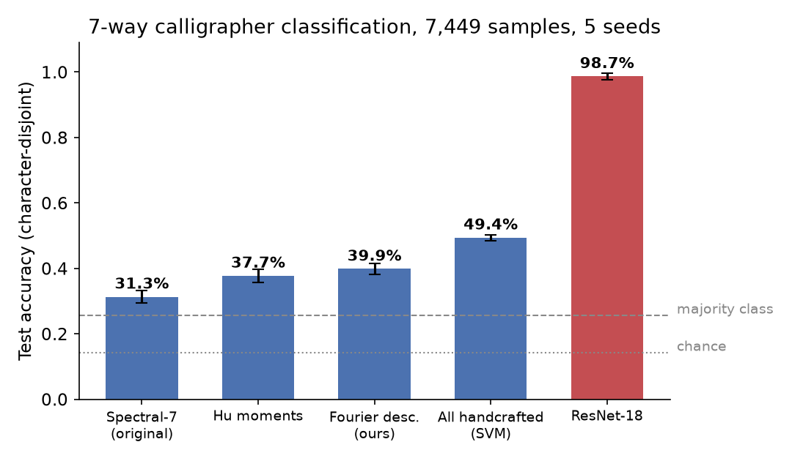
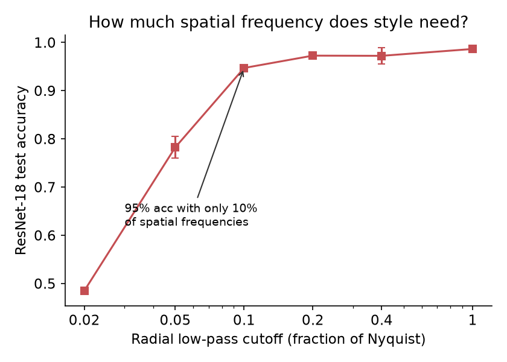

# 墨跡 Mozji — Where Does Calligraphic Style Live in the Frequency Domain?

以頻域分析與電腦視覺研究中國書法風格：**7 位書法家、10 本字帖、7,449 張單字圖、1,057 個獨特字**的策展資料集，加上一系列可解釋性實驗，以及一個部署上線的書法學習平台。

**Live platform**: [calligraphy-analyzer.onrender.com](https://calligraphy-analyzer.onrender.com) ｜ **Technical report**: [`report/report.md`](report/report.md)

---

## 研究發現（TL;DR）

所有實驗採 **character-disjoint** 評估：測試「字」在訓練時完全沒出現過，模型只能靠風格泛化，不能靠認字。

| # | 發現 | 數字 |
|---|------|------|
| 1 | **書法家身份 95% 寫在「間架結構」裡**——把字圖低通濾波到只剩 10% 空間頻率，CNN 仍有 95% 準確率；筆鋒細節只貢獻最後 ~4 個百分點。傳統書論「結構為本、筆法為末」的量化證據。 | 10% Nyquist → 94.7% |
| 2 | **風格 embedding 可跨字、跨字帖泛化**——同字配對驗證（兩張同一個字，是否同一人寫？）在沒看過的字上 AUC 0.998；限制正例為「不同字帖」仍有 0.989。 | AUC 0.989（cross-book） |
| 3 | **可解釋頻域特徵承載約一半訊號**——正規化輪廓傅立葉描述子＋Hu 矩＋頻譜統計合體 49.4%（多數類 25.7%），且訊號分散在整個諧波頻譜。ResNet-18 為 98.7%。 | 49.4% vs 98.7% |
| 4 | **誠實的混淆分析**——同一書法家的不同字帖能被互分（88.3%），代表「字帖簽名」存在；留一字帖測試顯示風格大致可轉移到全新字帖（72–99%）。 | 詳見報告 §5.4 |
| 5 | **跨資料集才是真戰場**——在獨立蒐集的 4 萬張外部資料上，準確率塌縮到 32%；骨架化＋固定寬度重繪後部分恢復（顏真卿 16%→75%）。within-source 容易、cross-source 是開放問題。 | 32% → 42% |
| 6 | **同字真跡的生成評估協定**——FontDiffuser zero-shot 生成 210 字，用「該書法家真的寫過這個字」的 ground truth 量化：內容忠實（SSIM 0.53）但書法家身份不足（style match 22.9%，上限 74.8%）。 | 詳見報告 §5.6 |




## 資料集

| 書法家 | 時代 | 字帖數 | 圖片 | 獨特字 |
|--------|------|--------|------|--------|
| 智永 | 隋 | 1 | 720 | 720 |
| 歐陽詢 | 唐 | 1 | 936 | 485 |
| 虞世南 | 唐 | 1 | 316 | 228 |
| 顏真卿 | 唐 | 1 | 1,725 | 631 |
| 柳公權 | 唐 | 1 | 1,399 | 492 |
| 趙孟頫 | 元 | 1 | 442 | 282 |
| 沈尹默 | 近代 | 4 | 1,911 | 553 |
| **合計** | | **10** | **7,449** | **1,057** |

獨門結構：**同字跨書法家配對**——每個字連結到所有寫過它的書法家（`data/index/character_index.json`），支撐公開資料集（單張標籤）做不到的 text-dependent 風格分析。圖片蒐集自網路上公開的碑帖翻攝資料；本專案的貢獻是清理、逐字標注、索引與配對管線。

## 重現實驗

```bash
python -m venv .venv && source .venv/bin/activate
pip install torch torchvision opencv-python-headless scikit-learn scipy matplotlib pandas tqdm

python experiments/build_manifest.py    # 資料清單（7,449 筆）
python experiments/run_classical.py     # 實驗一：傳統特徵 × 3 分類器 × 5 seeds
python experiments/run_cnn.py           # 實驗一：ResNet-18 baseline（GPU）
python experiments/run_ablation.py      # 實驗二：諧波掃描 + 2D 低通消融
python experiments/run_pairverify.py    # 實驗三：同字配對驗證
python experiments/run_confound.py      # 混淆檢查 R1–R3
python experiments/run_lobo.py          # 留一字帖測試
python experiments/make_figures.py      # 產生報告圖表
```

每支腳本輸出 CSV 結果與 log；特徵有快取（`experiments/cache/`）。

## 學習平台（墨跡習字）

研究發現直接回饋到平台設計：診斷回饋**以結構性差異優先**（低頻訊號佔 95%）、筆法細節其次。

- **練字診斷**：上傳習字照片 → 與名家逐像素差異疊合圖（紅=多寫、藍=少寫）、重心/均衡分析——描述性回饋，不給武斷的總分
- **同字比對**：任一字並排顯示所有寫過它的書法家
- **風格量化**：頻譜特徵雷達圖，附 ANOVA 顯著性與效果量（誠實標注哪些差異在雜訊範圍內）

```bash
pip install -r requirements.txt
python run_web.py   # http://localhost:8000
```

## 專案結構

```
├── report/report.md          # 技術報告（研究主文件）
├── experiments/              # 全部實驗程式碼與結果
│   ├── build_manifest.py     #   資料清單
│   ├── features.py           #   正規化輪廓傅立葉描述子等特徵
│   ├── run_*.py              #   實驗腳本（見上）
│   └── figures/              #   報告圖表
├── src/                      # 核心：FFT、SVG、前處理、分析
├── web/                      # FastAPI 平台（routers/services/templates）
├── tools/build_pairs.py      # zi2zi 格式配對資料生成
├── data/index/               # 字元索引、風格特徵、相似度矩陣
└── Fonts/my_fonts/           # 字帖圖片與 CSV 標注（不入版控）
```

## 引用與授權

書法圖片版權屬原始碑帖與其整理者，僅供學術研究使用。程式碼 MIT。

*Doreen Lin (林沁瑩), National Tsing Hua University CS. 本專案始於個人十年書法學習經驗中的真實痛點。*
