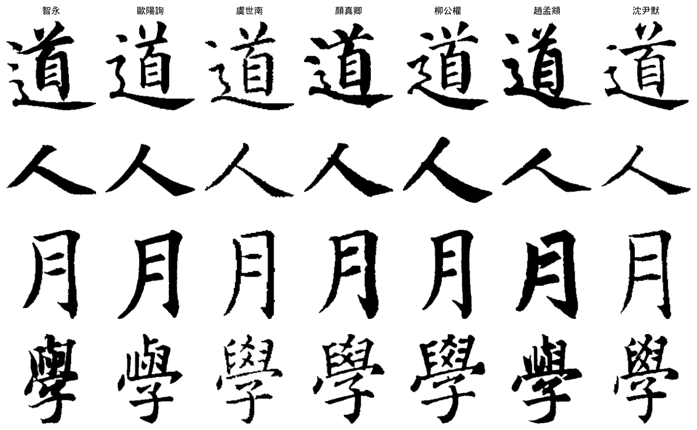
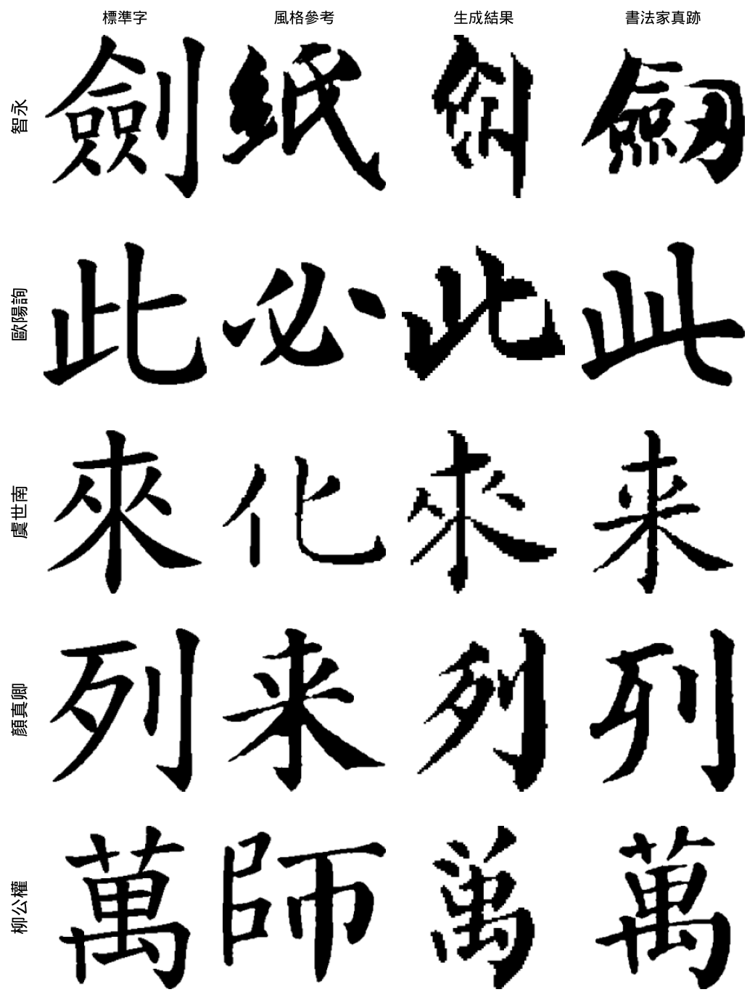

# 墨跡 Mozji: Where Does Calligraphic Style Live in the Frequency Domain?


學書法時常遇到一個問題：想臨某位書法家的某個字，他卻沒有寫過，找不到範帖。這個專案從這個問題出發，先建立同字跨書法家的字庫，再用頻域分析研究書法家的風格藏在哪裡，接著以生成模型補出書法家沒寫過的字，最後把成果做成線上學習平台「墨跡習字」。

- **資料**：7 位書法家、10 本字帖、7,449 張單字圖、1,057 個獨特字
- **平台**：[calligraphy-analyzer.onrender.com](https://calligraphy-analyzer.onrender.com)
- **示範影片（58 秒）**：[calligraphy_demo.mp4](https://github.com/Doreen1113/Digital-Calligraphy-FFT-Analysis/releases/download/v1.0-demo/calligraphy_demo.mp4)
- **技術報告**：[`report/report.md`](report/report.md)

## 主要發現

所有辨識實驗都採 character-disjoint 切分：測試用的字在訓練時完全沒有出現過，模型只能依靠風格判斷，不能靠認字。

| 發現 | 關鍵數字 |
|------|------|
| **書法家的身分主要在字的結構裡。** 把字圖低通濾波到只剩 10% 空間頻率，ResNet-18 仍有 94.7% 準確率，筆鋒細節只再貢獻約 4 個百分點，與書論「結構為本、筆法為末」的說法一致。 | 10% 頻率 → 94.7% |
| **風格表徵能跨字、跨字帖泛化。** 給兩張同一個字的圖，判斷是否為同一人所寫：在沒看過的字上 AUC 0.998；限定正例來自不同字帖時仍有 0.989。 | AUC 0.989 |
| **可解釋的手工特徵約能解釋一半。** 輪廓傅立葉描述子、Hu 矩與頻譜統計合併後為 49.4%（多數類基準 25.7%），ResNet-18 為 98.7%。 | 49.4% vs. 98.7% |
| **字帖本身也會留下痕跡。** 同一位書法家的不同字帖可以被區分（88.3%）；在留一字帖測試中，風格大致能轉移到沒看過的字帖（72–99%）。 | 見報告 §5.4 |
| **換一個資料來源，準確率大幅下降。** 在另外蒐集的四萬張外部資料上只有 32%；骨架化並統一筆寬後回升到 42%（顏真卿從 16% 升到 75%）。跨來源泛化仍是未解的問題。 | 32% → 42% |
| **生成字保留了標準字的骨架。** 以「書法家真的寫過這個字」作為標準答案評估 FontDiffuser：微調加上驗證式重排序，把風格辨識率從 20.0% 提升到 34.3%。另外設計的頻域結構損失讓生成字的字形明顯更接近真跡（內容洩漏率 39.0% → 28.6%，p = 0.030），風格辨識率卻沒有跟著上升。幾何上的相似與風格上的辨識之間的落差，是下一步要處理的問題。 | 20.0% → 34.3% |



同一個字在七位書法家筆下的寫法。字庫以這種同字配對為核心，分析時可以固定文字內容，只比較風格。


只保留 10% 的空間頻率，辨識準確率仍有 94.7%。



由左至右為標準字、風格參考字、生成結果與書法家真跡。生成字的筆畫質感接近真跡，字形結構卻仍偏向標準字。

## 資料集

| 書法家 | 時代 | 字帖數 | 圖片 | 獨特字 |
|--------|------|--------|------|--------|
| 智永 | 隋 | 1 | 720 | 720 |
| 歐陽詢 | 唐 | 1 | 936 | 485 |
| 虞世南 | 唐 | 1 | 316 | 228 |
| 顏真卿 | 唐 | 1 | 1,725 | 631 |
| 柳公權 | 唐 | 1 | 1,399 | 492 |
| 趙孟頫 | 元 | 1 | 442 | 282 |
| 沈尹默 | 近代 | 4 | 1,911 | 553 |
| **合計** | | **10** | **7,449** | **1,057** |

每個字都連結到所有寫過它的書法家（`data/index/character_index.json`）。一般公開資料集的每張圖只有一個書法家標籤，無法固定文字內容來比較風格，這份字庫的同字配對讓這類分析成為可能。圖片來自網路上公開的碑帖翻攝，本專案的工作是清理、逐字切割標注，以及建立索引與配對。

## 墨跡習字平台

研究結果直接用在平台設計上：辨識訊號大多落在低頻結構，所以診斷時先指出結構上的差異，再談筆法細節。

- **集字**：輸入一段文字並選擇書法家，書法家沒寫過的字由生成模型補上，並標示哪些是 AI 補字、哪些是真跡。
- **筆劃診斷**：上傳自己寫的字，與書法家的字對齊後疊圖比較（紅色是多寫、藍色是少寫），並分析重心與上下左右的平衡。回饋以描述為主，不給總分。
- **字庫搜尋**：查詢一個字，並排顯示所有寫過它的書法家。

```bash
pip install -r requirements.txt
python run_web.py   # http://localhost:8000
```

## 重現實驗

```bash
python -m venv .venv && source .venv/bin/activate
pip install torch torchvision opencv-python-headless scikit-learn scipy matplotlib pandas tqdm

python experiments/build_manifest.py    # 資料清單（7,449 筆）
python experiments/run_classical.py     # 傳統特徵 × 3 種分類器 × 5 seeds
python experiments/run_cnn.py           # ResNet-18 基準（需 GPU）
python experiments/run_ablation.py      # 諧波掃描與 2D 低通消融
python experiments/run_pairverify.py    # 同字配對驗證
python experiments/run_confound.py      # 字帖混淆檢查
python experiments/run_lobo.py          # 留一字帖測試
python experiments/make_figures.py      # 產生報告圖表
```

每支腳本會輸出 CSV 結果與 log，特徵快取在 `experiments/cache/`。生成實驗（`run_generation.py`、`run_gen_eval.py`、`run_rerank_eval.py`）需要另外安裝 FontDiffuser，設定細節見報告 §5.6。

## 專案結構

```
├── report/report.md          # 技術報告
├── experiments/              # 實驗程式碼與結果
│   ├── features.py           #   輪廓傅立葉描述子等特徵
│   ├── run_*.py              #   辨識與生成實驗
│   └── figures/              #   報告圖表
├── src/                      # FFT、SVG、前處理與分析
├── web/                      # FastAPI 平台
├── tools/                    # 配對資料生成、生成服務
├── data/index/               # 字元索引、風格特徵、相似度矩陣
└── Fonts/my_fonts/           # 字帖圖片與標注（不納入版控）
```

## 授權

書法圖片的版權屬於原碑帖與其整理者，僅供學術研究使用；程式碼採 MIT 授權。

林沁瑩（Doreen Lin），國立清華大學資訊工程學系
